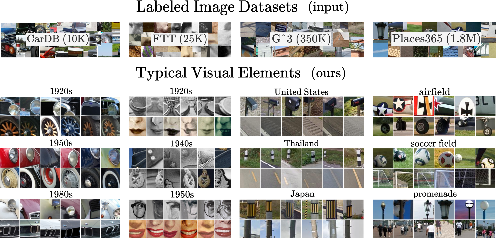

<div align="center">
<h2>Diffusion Models as Data Mining Tools
<p></p>
<a href="https://imagine.enpc.fr/~siglidii/">Ioannis Siglidis</a>, <a href="https://holynski.org/">Aleksander Hołyński</a>,
<a href="https://people.eecs.berkeley.edu/~efros/">Alexei A. Efros</a>, <br/>
<a href="https://imagine.enpc.fr/~aubrym/">Mathieu Aubry</a>,
<a href="https://people.eecs.berkeley.edu/~shiry/">Shiry Ginosar</a>

<p></p>
<a href="https://diff-mining.github.io/"></a>
<a href="https://arxiv.org/abs/2307.05473"></a>
<a href="https://diff-mining.github.io/ref.bib"></a>
<p></p>



</h2>
</div>

Official PyTorch implementation of [Diffusion Models as Data Mining Tools](https://imagine.enpc.fr/~ioannis.siglidis/diff-mining), which has been accepted in ECCV'24.

## Introduction 
Our approach allows you to take a large labelled input dataset, and mine the patches that are important for each label.
It involves three steps: 
1. First you finetune Stable-Diffusion v1.5 with its standard loss $L_t(x, \epsilon, c)$ with prompts of the form $\text{"An image of Y"}$ (where Y is your label) in your custom dataset.  
2. For a sample of your input data you want to analyze, you then compute typicality $\mathbf{T}(x|c) =  \mathbb{E}_{\epsilon,t}[L_t(x, \epsilon, \varnothing) - L_t(x, \epsilon, c)]$ for all images.
3. You extract the top-1000 patches according to $\mathbf{T}(x | c)$ and then you cluster them using DIFT-161 features (ranking clusters according to median typicality of their elements).

### Installation 🌱
Our codebase is mainly developed on [diffusers](https://github.com/huggingface/diffusers/) implementation of [LDMs](https://arxiv.org/abs/2112.10752).
```bash
conda env create -f environment.yaml
conda activate diff-mining
```

### Data 💽
We apply our method in 5 different types of datasets: cars ([CarDB](https://pages.cs.wisc.edu/~yongjaelee/projects/lee_efros_hebert_bookchapter.pdf)), faces ([FTT](https://facesthroughtime.github.io/)), street-view images ([G^3](https://arxiv.org/abs/2211.15521)), scenes ([Places](http://places2.csail.mit.edu/download.html), high-res) and X-rays ([ChestX-ray](https://arxiv.org/abs/1705.02315)):

- A properly extracted version of CarDB can be found [here](https://huggingface.co/datasets/diff-mining/cardb) and can be downloaded with:
```bash
python scripts/download-cardb.py
```
- FTT: you can request access for downloading the dataset in the [original project page](https://facesthroughtime.github.io/).: 
- G^3: unfortunately proprietary but information about PanoramaIDs can be found on the [original repo](https://github.com/g-luo/geolocation_via_guidebook_grounding).
- Places: you can request access (trivial to get) from [original project page](https://forms.gle/w4VoNMED3hgb1m3AA).

### Models 🔬
We share our models on huggingface which you can access through the handles:
- [`diff-mining/cardb`](https://huggingface.co/diff-mining/cardb)
- [`diff-mining/ftt`](https://huggingface.co/diff-mining/ftt)
- [`diff-mining/g3`](https://huggingface.co/diff-mining/g3)
- [`diff-mining/xray`](https://huggingface.co/diff-mining/xray)
- [`diff-mining/places`](https://huggingface.co/diff-mining/places)

or download them locally using:
```bash
python scripts/download-models.py
```

## Approach 

A full walkthrough of the pipeline can be seen in scripts: `scripts/training.sh` and `scripts/typicality.sh`.
- Code for finetuning models can be found under: `diffmining/finetuning/`.
- Code for computing typicality can be found at: `diffmining/typicality/compute.py`.
- Code for averaging typicality across patches, computing DIFT features and clustering can be found at: `diffmining/typicality/cluster.py`

### Applications🔸

We test our typicality measure in two different approaches which we properly discuss in our paper.

#### Clustering of Translated Visual Elements 
Using our diffusion model, we can translate each image, e.g. in the case of geography, from one country to another.
We use [PnP](https://arxiv.org/abs/2211.12572) which is the only method we found that was relatively robust in keeping a consistency between translated objects (i.e., windows would remain windows).
You can launch this translation by running:
```bash
source scripts/parallel.sh translate
```

Afterwards you need to compute typicality for all elements:
```bash
source scripts/parallel.sh compute
```

and then cluster them using:
```bash
source scripts/parallel.sh cluster
```

#### Emergent Disease Localization in X-rays 🩻
As typicality is connected to a binary classifier of the conditional vs the null conditioning, it can be used to "spatialize" information related to the condition on the input image.
We test this on X-ray images and show how typicality is improved after finetuning. To reproduce our results and evaluations run:
```bash
source scripts/xray.sh
```

### Comparing with Doersch et al. 2012 🥐
We provide a minimal optimized implementation of the algorithm of ["What makes Paris look like Paris?"](http://graphics.cs.cmu.edu/projects/whatMakesParis/) under `doersch/`.
Running the code should only require:
```bash
python doersch.py --which geo --category 'Italy'
```
yet you will probably have to adjust it to the dataset of choice.

### Citing 💫

```bibtex
  @article{diff-mining,
    title = {Diffusion Models as Data Mining Tools},
    author = {Siglidis, Ioannis and Holynski, Aleksander and Efros, A. Alexei and Aubry, Mathieu and Ginosar, Shiry},
    journal = {ECCV},
    year = {2024},
  }
```

### Acknowledgements 
This work was partly supported by the European Research Council (ERC project DISCOVER, number 101076028) and leveraged the HPC resources of IDRIS under the allocation AD011012905R1, AD0110129052 made
by GENCI. We would like to thank Grace Luo for data, code, and discussion; Loic Landreu and David Picard for insights on geographical representations and diffusion; Karl Doersch, for project advice and implementation insights; Sophia Koepke for feedback on our manuscript.
